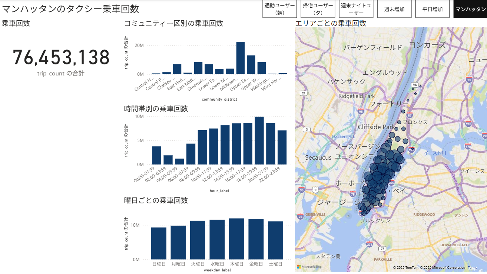
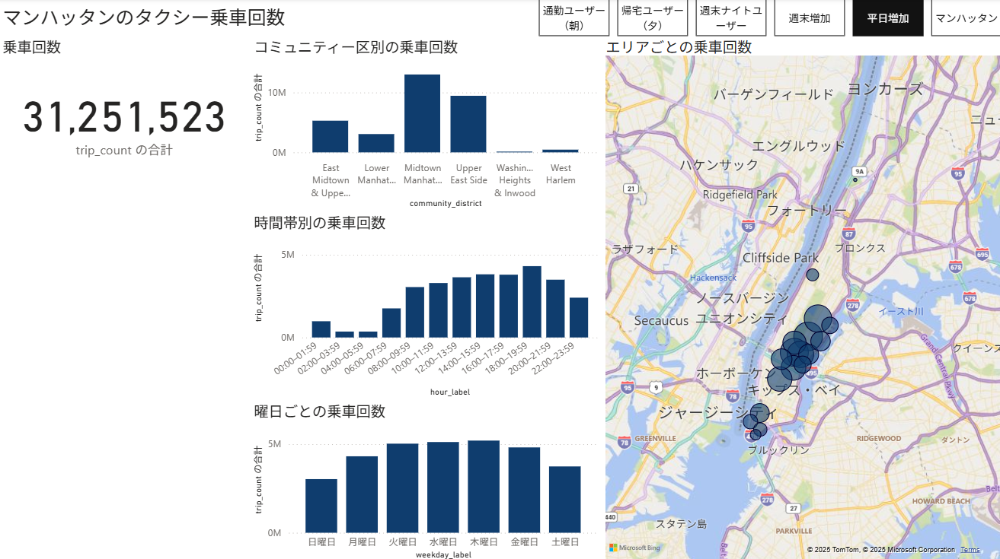
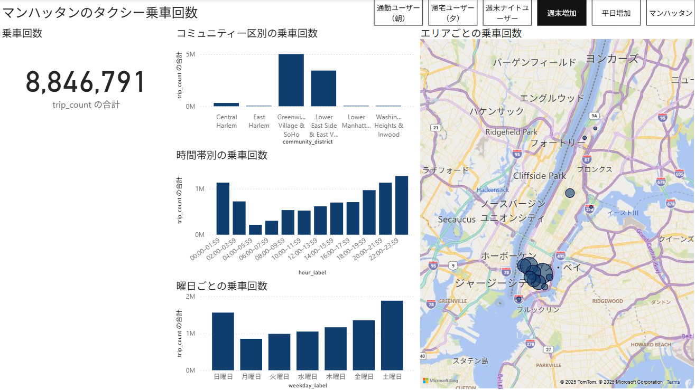

# NYCタクシー分析  
## 乗車データから広告ターゲットの発見を目指す
本ページは、NYCタクシー乗車データを用いた分析プロジェクト  
「NYCタクシー分析：乗車データから広告ターゲットの発見を目指す」の概要をまとめたものです。

<iframe src="https://docs.google.com/presentation/d/e/2PACX-1vQPKqQesAgeF-3Wv_1IwxSPu6ERNKpq9SuAoUnEWO5axIevPHZtu3Ds1PYNivX1eQ/pubembed?start=false&loop=false&delayms=3000" frameborder="0" width="640" height="389" allowfullscreen="true" mozallowfullscreen="true" webkitallowfullscreen="true"></iframe>

## 第1章 成果物の概要

### プロジェクトの目的

- 大規模データ（NYC タクシーの乗車データ）を **SQL** で加工する
- **データ整備 → 分析 → 可視化 → ビジネス提案** までを一貫して実行する
- 実データから傾向を読み取り、**タクシー車内広告のターゲット発見** につなげる

### 仮想プロジェクト設定

- 想定クライアント：タクシー車内のデジタルサイネージ事業者
- 課題仮説：
  - 「広告掲載はしているが、ターゲットの粒度が粗く、効果が見えにくい」
- 分析のゴール：
  - **どのエリア × どの時間帯 × どの曜日で、どのような乗客が多いか** を把握し、
  - 広告の「いつ・どこで・誰に」を具体化すること

---

## 第2章 使用データと整備

### データセット

- データソース：Google BigQuery Public Datasets  
  `new_york_taxi_trips`（Yellow Taxi を対象）
- 対象期間：**2019年**（COVID-19 前で、平常時の需要を想定）
- レコード数：約 **8,400万件**（Yellow Taxi 2019年分）

### 主な前処理・フィルタリング

- 乗車／降車日時が不正なレコードを除外
- 走行距離が 0、または極端に長いレコードを除外
- 運賃・チップが 0 未満など、明らかな異常値を除外
- 分析単位に合わせて、以下の粒度へ集約  
  - **エリア（Taxi Zone）**
  - **時間帯（hour）**
  - **曜日（weekday）**

---

## 第3章 テーブル構成と分析設計

分析には、BigQuery 上に作成した中間テーブル・マスタテーブルを使用しました。  
ここでは代表的なもののみ記載しています。

### 3-1. 中核ファクトテーブル

**`fact_trip_zone_hour_2019`**

- 粒度：**zone × hour × weekday**
- 主なカラム：
  - `zone_id`（Taxi Zone）
  - `hour`（0–23時）
  - `weekday`（0=月曜〜6=日曜）
  - `trip_count`（乗車回数）
  - `avg_fare_amount`（平均運賃）
  - `avg_tip_amount`（平均チップ）
  - `avg_trip_distance`（平均走行距離）

このテーブルを基点に、エリア・時間帯・曜日別の需要パターンを把握しています。

### 3-2. トレンド分類テーブル

**`pickup_zone_daytype_trend_2019`**

- 役割：**平日／週末のトレンド差** を分類するための補助テーブル
- 例：
  - 平日朝にピークがあるエリア
  - 週末夜にピークがあるエリア
  - 平日と週末で差が小さいエリア など

### 3-3. ER 図イメージ

中心となる `fact_trip_zone_hour_2019` に対し、

- `zone_master`：エリア名称・ボロウ情報
- `calendar_master`：曜日／祝日区分
- `daytype_trend`：平日・週末トレンドの分類

などのマスタを結合する構成です。  
Power BI 上でのフィルタ・連動操作を意識して、  
「エリア」「時間」「曜日」の軸を切り替えやすいリレーション設計にしています。

> （図）  
> 

---

## 第4章 Power BI による可視化と発見

### 可視化の構成

- ページ構成
  - ニューヨーク全体
  - マンハッタンにフォーカスしたページ
  - 平日 vs 週末の比較
  - ペルソナ別ビュー（ブックマーク切替）

- 主な可視化
  - **マンハッタン地図上の乗車回数ヒートマップ**
  - **時間帯 × 曜日 × エリア別のトレンドグラフ**
  - **選択条件に応じた KPI カード（乗車回数、平均運賃など）**

> （例）
> **マンハッタンエリアの乗車傾向**
> 
>
> 
> **平日に増加するエリアの乗車傾向**
> 
>
>
> **週末に増加するエリアの乗車傾向**
> 

### 可視化から得られた主な傾向（例）

- 平日朝：住宅エリア → ビジネスエリアへの移動が多い
- 平日夕方〜夜：ビジネスエリアから住宅エリアへの戻り需要を想定
- 週末深夜：飲食店・ナイトスポット周辺で乗車が集中する

これらの傾向を、後述のペルソナ設計に利用しています。

---

## 第5章 ペルソナと想定広告

PPT では、分析結果に基づき **2つの代表的なペルソナ** を設定しています。  
いずれも「エリア × 時間帯 × 曜日」の条件が、乗客像と結びつくケースです。

### 5-1. ペルソナA：通勤・帰宅ユーザー

- 年齢：40代後半
- 性別：男性
- 居住地：アッパーイーストサイド
- 職業：金融系企業勤務（マネージャークラス想定）
- 利用パターン：
  - 平日 朝：住宅エリア → ダウンタウン／ミッドタウン方面へ
  - 平日 夕方〜夜：オフィスエリア → 住宅エリアへ
- 特徴：
  - 所得水準が高く、時間価値も高い
  - 雨天や冬季はタクシー利用が増える想定

!(images/通勤ユーザー.png)

**想定する広告例**

- 高級スーツ、腕時計
- ゴルフ用品、ラグジュアリーブランド
- 高級自動車、ヨット
- 資産運用・金融商品（投資信託、プライベートバンキング など）

> 通勤・帰宅の「ルート × 時間帯 × 曜日」がある程度固定されているため、  
> **同じ乗客像に繰り返し訴求できる枠** として価値が高い。

---

### 5-2. ペルソナB：ナイトライフユーザー

- 年齢：20代中盤
- 性別：男性
- 居住地：ブルックリン
- 家族構成：単身
- 職業：金融・IT系の若手プロフェッショナルを想定
- 利用パターン：
  - 金曜・土曜の夜〜深夜に、マンハッタンのバー／クラブ周辺で乗車
  - 友人との飲み会・イベント帰りにタクシーを利用
- 特徴：
  - 可処分所得が高く、体験消費・自己投資への関心が強い
  - 都市部の移動にはタクシー＋シティバイクなどを併用

!(images/週末ナイトユーザー.png)

**想定する広告例**

- ジム・パーソナルトレーニング
- 国内・近隣国への短期旅行
- 動画配信サービス、ゲーム・サブスクリプション
- お酒・バー、ナイトライフ向けサービス

> 週末夜の特定エリアに集中するため、  
> **ナイトライフ関連サービスのターゲティング枠** として有望。

---

### 5-3. 現状の限界と今後の改善案

本分析では「エリア × 時間帯 × 曜日」の 3軸を中心としましたが、

- **平日日中・週末日中** のように、複数の属性が混在しやすい時間帯では  
  ペルソナを明確に分けるのが難しい場面もありました。

今後の改善アイデア：

- 「降車地点」「天候」「イベント情報」などの外部データを追加し、
  - 通勤／業務利用／観光／レジャー をより細かく分離する
- Green Taxi や地下鉄など、**他の交通データとの組み合わせ** を検討する

---

## 第6章 まとめ

- NYCタクシー乗車データ（約8,400万件）をもとに、  
  **「エリア × 時間帯 × 曜日」** で需要の傾向を可視化
- 可視化結果から、広告価値の高い条件（ペルソナA/B）を抽出
- タクシー車内広告において、
  - 「いつ・どこで・誰に」の解像度を上げることで、
  - 広告単価の引き上げや、新規広告主の開拓余地があることを示した

### 制作を通して得た学び（個人的な振り返り）

- 「傾向が出るか分からない」状態からスタートし、  
  データクリーニング → 集計設計 → 可視化 → ペルソナ設計まで一通り経験できた。
- 特に **「分析結果をビジネス価値に変換する部分」は、動画教材では学びきれず、  
  自分で考え続ける必要があった** 点が大きな学びだった。

---

## Appendix

- リポジトリ：[`ndyns/nyc-taxi-analysis`](https://github.com/ndyns/nyc-taxi-analysis)
- 使用技術：
  - データ基盤：Google BigQuery
  - 言語：SQL
  - 可視化：Power BI
  - その他：Taxi Zone マスタ、Community District 情報等を用いたエリア分類

- Tableauでの可視化[https://public.tableau.com/views/_17600769281410/1?:language=ja-JP&publish=yes&:sid=&:redirect=auth&:display_count=n&:origin=viz_share_link]

<noscript></noscript><object class='tableauViz'  style='display:none;'><param name='host_url' value='https%3A%2F%2Fpublic.tableau.com%2F' /> <param name='embed_code_version' value='3' /> <param name='site_root' value='' /><param name='name' value='_17600769281410&#47;1' /><param name='tabs' value='no' /><param name='toolbar' value='yes' /><param name='static_image' value='https:&#47;&#47;public.tableau.com&#47;static&#47;images&#47;_1&#47;_17600769281410&#47;1&#47;1.png' /> <param name='animate_transition' value='yes' /><param name='display_static_image' value='yes' /><param name='display_spinner' value='yes' /><param name='display_overlay' value='yes' /><param name='display_count' value='yes' /><param name='language' value='ja-JP' /><param name='filter' value='publish=yes' /></object>

